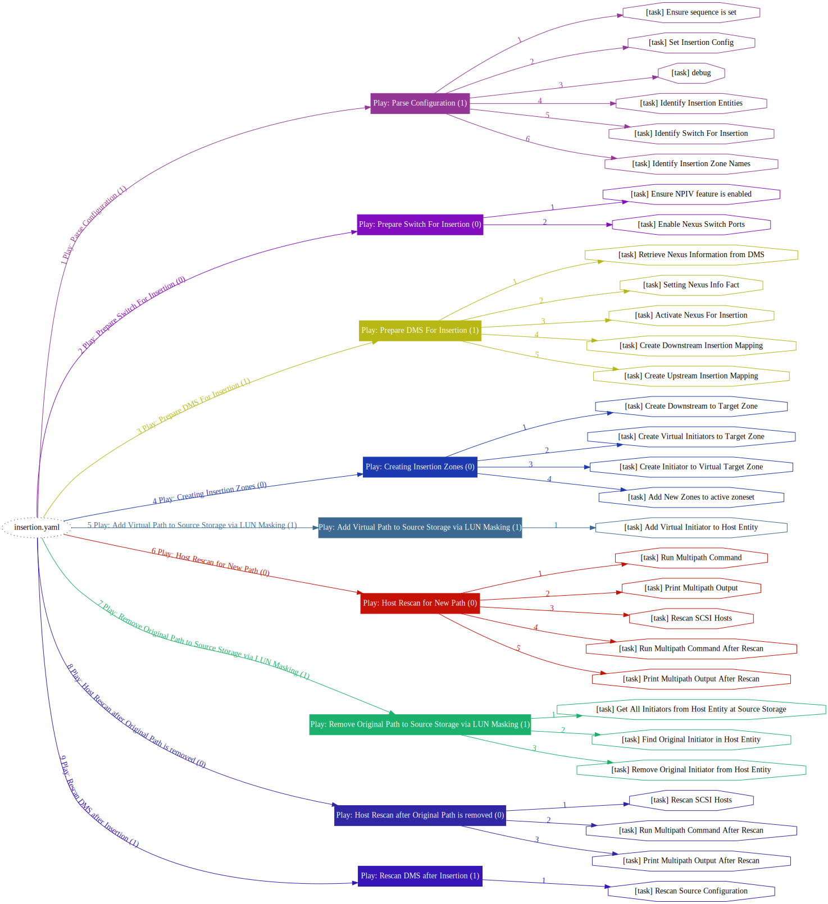
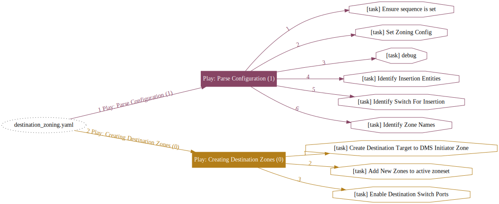
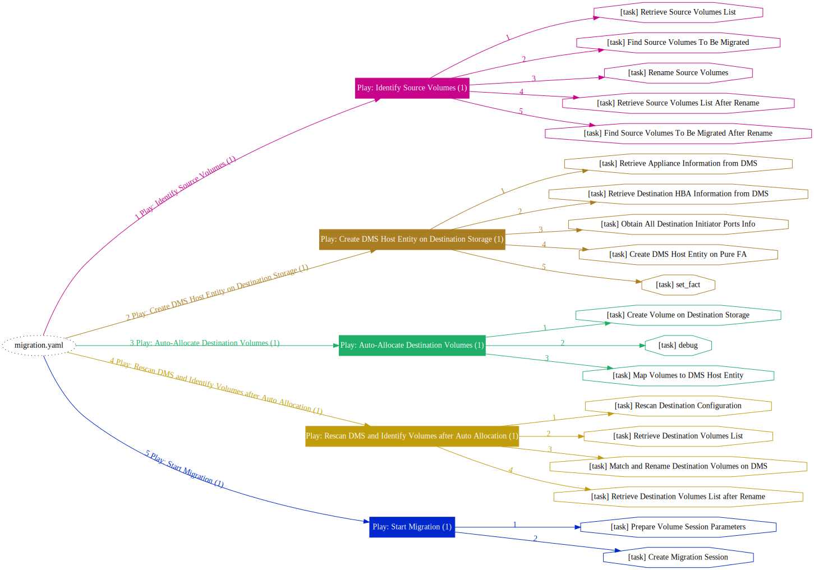
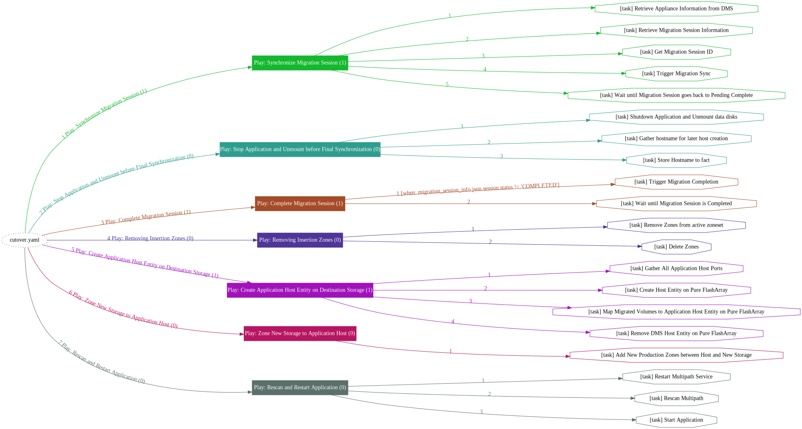

# DMS Ansible Playbook Examples

This repository is a series of [**Ansible Playbooks**](dms/playbooks) that automates a live migration end-to-end, from insertion to migration and cutover, using REST API of Cirrus Data's **Cirrus Migrate On-Prem
v2022** (aka DMS).


***⚠️ THIS IS AN EXAMPLE THAT RUNS AS-IS IN A PREDEFINED TEST ENVIRONMENT INTERNAL TO CIRRUS DATA. IT WILL NOT WORK AS-IS ON ANY ARBITRARY ENVIRONMENTS WITHOUT CUSTOMIZATION AND MODIFICATIONS.***

[Contact Cirrus Data](mailto:info@cdsi.us.com) to learn more if you are interested in a hands-on lab session in this environment using Cirrus's Lab-as-a-Service facility (see Note 1).

# Prerequisites
Before you start, you should have:
- Sufficient knowledge on Ansible, including how to execute Ansible Playbooks, specify variables, etc.
- Sufficient knowledge on SAN environments
- Hands-on experiences with DMS using GUI/cli and sufficient understanding on DMS concepts including insertion methods, migration, cutover process,
  uninsertion., etc.
- Understand the differences between automated insertion vs. using **insertion wizard** from DMS's web management UI.
    - Automated insertion is most suitable to large enterprise environment where DMS's general purpose insertion wizard may not be sufficient.  These enterprises typically:
        - has existing automation framework
        - has very good SAN environment infrastructure inventory information, and
        - has a robust set of naming conventions.

Contact Cirrus Data's Professional Service for more information.


# Objective
The objective of this example is to exclusively use ansible playbooks (no manual steps) to perform the following:
1. Perform Live No-Downtime Insertion for a host that is currently using storage volumes from a **source storage array**, which in this example is a generic FC-based storage (see Note 2).
    - Multiple insertions will be done to intercept all data paths in both fabrics
    - Path Insertion will be used in this example
    - All necessary **host remediation**, **zoning and LUN masking** changes, and all **post insertion tasks** will be automated
2. Connect DMS Appliances Pair to Destination Storage via **switch zoning**. In this example, Pure Storage's FlashArray is used as destination storage.
3. **Automatically create** all storage volumes from Pure FlashArray for DMS to use as migration destinations (similar to DMS GUI's Auto-allocation using a Storage Plug-in).
4. **Identify** and automatically pair new storage volumes with source volumes
5. **Start Migration** by creating migration session with the discovered storage configuration.
6. **Periodically Re-Sync** migration sessions
7. **Cutover** application host once migration finishes.
    - After cutover, application host will access new storage (Pure FlashArray) directly
    - All necessary **zoning changes** will be automated
    - All necessary **LUN masking** changes will be automated.

Note 1: This sample can be run as-is using _Scenario 502_  of the Cirrus Data Solutions **LABaaS** (Lab-as-a-Service).  Contact CDS Profession Services team for access.
Note 2: The generic FC-based storage is actually a Cirrus Data Solutions _Cirrus Protect On-prem Server_.

# Configuration
This example uses a [variable file](dms/vars/config.yaml) to describe the entire automated operation.

The variable file describes the identity of all the relevant SAN infrastructure components and the desired migration and cutover configuration.


# Playbooks
Multiple [playbooks](dms/playbooks) are included in this repository. Detailed descriptions are added as comments inside each of the playbook.


## insertion.yaml
This playbook performs insertion and all necessary remedies. Due to the nature of insertion, it is designed to insert one path at a time so that proper validation can be executed in between. Use argument "sequence" to specify which path to execute, i.e. the sequence of paths specified in the configuration file.

```bash
ansible-playbook -i hosts.yaml playbooks/insertion.yaml -e sequence=0
ansible-playbook -i hosts.yaml playbooks/insertion.yaml -e sequence=1
ansible-playbook -i hosts.yaml playbooks/insertion.yaml -e sequence=2
```



## destination_zoning.yaml
This playbook connects DMS appliance to destination storage according to the configuration. Due to the nature of zoning changes, it is designed to zone one port at a time so that proper validation can be performed in between.

```bash
ansible-playbook -i hosts.yaml playbooks/destination_zoning.yaml -e sequence=0
ansible-playbook -i hosts.yaml playbooks/destination_zoning.yaml -e sequence=1
ansible-playbook -i hosts.yaml playbooks/destination_zoning.yaml -e sequence=2
...
```


## migration.yaml
This playbook will follow the configuration file's ``migration`` section and automatically allocate/assign destination storage and start migration.

```bash
ansible-playbook -i hosts.yaml playbooks/migration.yaml
```


## cutover.yaml
This playbook will sync and complete migration session, and cut-over application host to access the destination storage directly. Zoning and storage changes are included in this playbook.

```bash
ansible-playbook -i hosts.yaml playbooks/cutover.yaml
```


## Licensing
This project is licensed under the Apache License, Version 2.0. See
[LICENSE](https://github.com/docker/docker/blob/master/LICENSE) for the full
license text.

## Support
This project is published as-is and no community support will be provided. [Contact](mailto:info@cdsi.us.com) Cirrus Data Professional Service Team to learn more. 